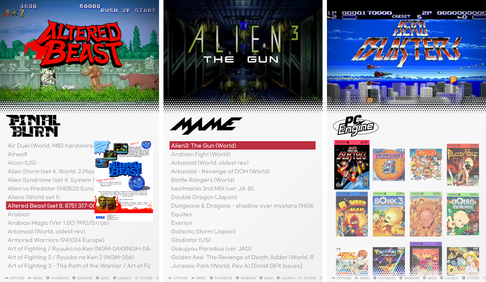

# ssimple v - 레트로파이 에뮬레이션스테이션용 세로 테마
'SSIMPLE V'\
라즈겜동에서 만든 수직 디스플레이용 테마입니다.
cafe.naver.com/raspigamer

## 변경사항
- v 1.1 4:3 화면비 및 수평 테마 추가
- v 1.0

## 사용법

### 옵션에서 다음과 같이 설정해주세요:
- UI 설정 > 전환 스타일: INSTANT
- UI 설정 > 회전메뉴 전환: SLIDE (또는 NONE)

**보다 정돈된 화면을 보셔면 비디오, 이미지, 섬네일, 마키등이 설정된 gamelist.xml이 준비되어 있어야합니다**

### 호환성

**16:9의 세로화면에 맞춘 테마입니다**\
1080x1920 및 720x1280에서 테스트함

### 화면비 옵션

- theme.xml : 9:16 세로
- theme-P34.xml : 3:4 세로
- theme-L.xml : 16:9 가로
- theme-L43.xml : 4:3 가로

** 원본 'theme.xml' 파일을 'theme.xml.ori'로 이름을 변경하고 사용할 xml파일을 'theme.xml'로 이름을 바꿔주세요**\
  예 : 4:3 가로 화면비로 설정하려면 theme-L43.xml 을 theme.xml로 변경

## 라이센스

라이센스 요약:
* 허용:    - 공유 및 복제
           - 수정 및 변경
* 조건:    - 출처 및 저작자 표기
           - 변경사항 공지
		   - 동일 라이센스하에 배포
* 금지:    - 영리목적으로 사용

## LOGO NOTICE
* 사용된 로고 및 상표의 저작권은 해당 소유자에게 있습니다.

## Screenshots

## Video
